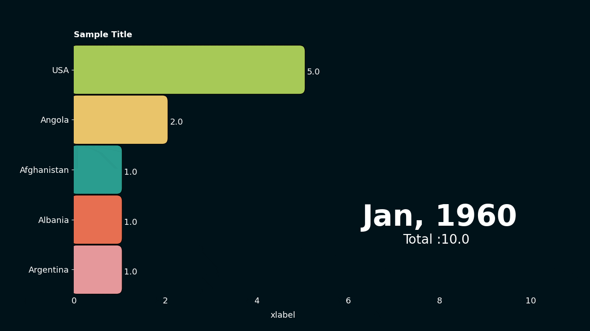

# Creating a dark themed bar chart race
## The data
We will use the previous data for this animation

```py
df = pd.DataFrame(
    {
        "time": ["1960-01-01", "1961-01-01", "1962-01-01"],
        "Afghanistan": [1, 2, 3],
        "Angola": [2, 3, 4],
        "Albania": [1, 2, 5],
        "USA": [5, 3, 4],
        "Argentina": [1, 4, 5],
    }
).set_index("time")
```

## Additional variables
There might be situations where we would like to show additional information for each column or date. 
For instance in the previous data we would like to show continents of each country.  
In such cases use a Dataframe containing the additional variables in this format.
```python 
columns,       continents
"Afghanistan",  "Asia"
"Angola",       "Africa"
"Albania",      "Europe"
"USA",          "N America"
"Argentina"     "S America" 
```
This is a column-wise data where the index is the columns of the original data
```python
col_var = pd.DataFrame(
    {
        "columns": ["Afghanistan", "Angola", "Albania", "USA", "Argentina"],
        "continent": ["Asia", "Africa", "Europe", "N America", "S America"],
    }
).set_index("columns")
```
Similarly we can use a row-wise data where the index is same as the original data.
```py
    time           leap-year var2   ...
    "1960-01-01"   "yes"     0
    "1961-01-01"   "no"      3
    "1962-01-01"   "no"      0

```
use the `dfr.add_var(col_var=col_var)` module to add these dataframes.  

## post_update
`post_update(self, i)` is a function that runs for every frame.  It is very useful for extending 
the basic animation. In this example we will use `post_update` to annotate continent names on bars. 

```py
def post_update(self, i):
    # annotates continents next to bars
    for ind, (bar, x, y) in enumerate(
        zip(self.bar_attr.top_cols, self.bar_attr.bar_length, self.bar_attr.bar_rank)
    ):
        self.ax.text(
            x - 0.3,
            y,
            self.dfr.col_var.loc[bar, "continent"],
            ha="right",
            color="k",
            size=12,
            zorder=ind,
        )
```
## Changing colors
All the text colors are set to white and the background color is made dark blue ("#001219"). 
```py
...
bar.set_title("Sample Title", color="w", weight=600)
bar.set_xlabel("xlabel", color="w")
...
``` 
We have also manually set colors for each bar.
```py
bar_cols = {
    "Afghanistan": "#2a9d8f",
    "Angola": "#e9c46a",
    "Albania": "#e76f51",
    "USA": "#a7c957",
    "Argentina": "#e5989b",
}
```
## The final code
```py
import os

import matplotlib as mpl
import numpy as np
import pandas as pd
from matplotlib import pyplot as plt

import pynimate as nim

dir_path = os.path.dirname(os.path.realpath(__file__))

mpl.rcParams["axes.facecolor"] = "#001219"
# Turning off the spines
for side in ["left", "right", "top", "bottom"]:
    mpl.rcParams[f"axes.spines.{side}"] = False

def post_update(self, i):
    # annotates continents next to bars
    for ind, (bar, x, y) in enumerate(
        zip(self.bar_attr.top_cols, self.bar_attr.bar_length, self.bar_attr.bar_rank)
    ):
        self.ax.text(
            x - 0.3,
            y,
            self.dfr.col_var.loc[bar, "continent"],
            ha="right",
            color="k",
            size=12,
            zorder=ind,
        )

df = pd.read_csv(dir_path + "/data/sample.csv").set_index("time")
col_var = pd.DataFrame(
    {
        "columns": ["Afghanistan", "Angola", "Albania", "USA", "Argentina"],
        "continent": ["Asia", "Africa", "Europe", "N America", "S America"],
    }
).set_index("columns")

bar_cols = {
    "Afghanistan": "#2a9d8f",
    "Angola": "#e9c46a",
    "Albania": "#e76f51",
    "USA": "#a7c957",
    "Argentina": "#e5989b",
}

cnv = nim.Canvas(figsize=(12.8, 7.2), facecolor="#001219")

dfr = nim.BarDatafier(df, "%Y-%m-%d", "3d")
dfr.add_var(col_var=col_var)

bar = nim.Barhplot(dfr, post_update=post_update, rounded_edges=True, grid=False)

bar.set_column_colors(bar_cols)
bar.set_title("Sample Title", color="w", weight=600)
bar.set_xlabel("xlabel", color="w")
bar.set_time(
    callback=lambda i, datafier: datafier.data.index[i].strftime("%b, %Y"), color="w"
)
bar.set_text(
    "sum",
    callback=lambda i, datafier: f"Total :{np.round(datafier.data.iloc[i].sum(), 2)}",
    size=20,
    x=0.72,
    y=0.20,
    color="w",
)
bar.set_bar_annots(color="w", size=13)
bar.set_xticks(colors="w", length=0, labelsize=13)
bar.set_yticks(colors="w", labelsize=13)
bar.set_bar_border_props(
    edge_color="black", pad=0.1, mutation_aspect=1, radius=0.2, mutation_scale=0.6
)
cnv.add_plot(bar)
cnv.animate()
plt.show()
```
## Result!
