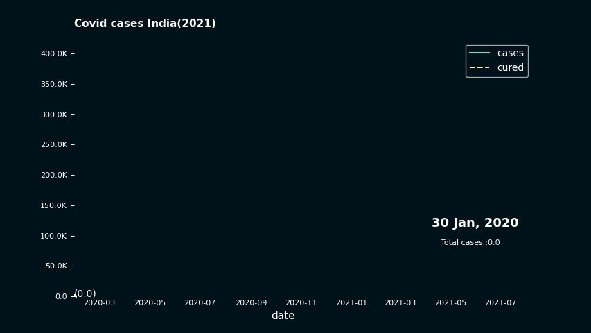

# Creating a dark themed Animated Line plot
## The data
We will be using [Covid 19 data from kaggle by 'SRK and Devakumar K. P'](https://www.kaggle.com/datasets/sudalairajkumar/covid19-in-india?select=covid_19_india.csv). You can use the already cleaned data from examples/data/Covid_IN.

|date      |cases|cured|
|----------|-----|-----|
|2020-03-28|185.0|13.0 |
|2020-03-29|115.0|16.0 |
|2020-03-30|181.0|6.0  |
|2020-03-31|154.0|22.0 |
|2020-04-01|475.0|20.0 |
|2020-04-02|235.0|12.0 |
|2020-04-03|401.0|10.0 |

## Theming
Let us setup the colors for the lineplot. We will be using `#001219` as the canvas color.
```python 
#Customizing matplotlib

import matplotlib as mpl
for side in ["left", "right", "top", "bottom"]:
    mpl.rcParams[f"axes.spines.{side}"] = False
mpl.rcParams["figure.facecolor"] = "#001219"
mpl.rcParams["axes.facecolor"] = "#001219"
mpl.rcParams["savefig.facecolor"] = "#001219"
```
We will also set all text colors to white.   

## post_update
`post_update(self, i)` is a function that runs for every frame.  It is very useful for extending 
the basic animation. In this example we will use `post_update` to format the xtick labels.   
`human_readable` converts large numbers to human readable format.

```py
def post(self, i):
    self.ax.yaxis.set_major_formatter(
        tick.FuncFormatter(lambda x, pos: human_readable(x))
    )
```
## Customizing line styles
Use `.set_column_linestyles()` to set linestyles. We will set 'cases' to solid and 'cured' to dashed.
```py
#Linestyle defaults to solid
plot.set_column_linestyles({"cured": "dashed"})
``` 
 
## The final code
```py
import os

import matplotlib as mpl
import matplotlib.pyplot as plt
import matplotlib.ticker as tick
import pandas as pd

import pynimate as nim
from pynimate.utils import human_readable

for side in ["left", "right", "top", "bottom"]:
    mpl.rcParams[f"axes.spines.{side}"] = False
mpl.rcParams["figure.facecolor"] = "#001219"
mpl.rcParams["axes.facecolor"] = "#001219"
mpl.rcParams["savefig.facecolor"] = "#001219"

dir_path = os.path.dirname(os.path.realpath(__file__))


def post(self, i):
    self.ax.yaxis.set_major_formatter(
        tick.FuncFormatter(lambda x, pos: human_readable(x))
    )


df = pd.read_csv(dir_path + "/data/covid_IN.csv").set_index("time")
cnv = nim.Canvas()
dfr = nim.LineDatafier(df, "%Y-%m-%d", "12h")
plot = nim.Lineplot(
    dfr,
    post_update=post,
    palettes=["Set3"],
    scatter_markers=False,
    legend=True,
    fixed_ylim=True,
    grid=False,
)
plot.set_column_linestyles({"cured": "dashed"})
plot.set_title("Covid cases India(2021)", y=1.05, color="w", weight=600)
plot.set_xlabel("xlabel", color="w")
plot.set_time(
    callback=lambda i, datafier: datafier.data.index[i].strftime("%d %b, %Y"),
    color="w",
    size=15,
)
plot.set_line_annots(lambda col, val: f"({human_readable(val)})", color="w")
plot.set_legend(labelcolor="w")
plot.set_text(
    "sum",
    callback=lambda i, datafier: f"Total cases :{human_readable(datafier.data.cases.iloc[:i+1].sum() )}",
    size=10,
    x=0.8,
    y=0.20,
    color="w",
)
plot.set_xticks(colors="w", length=0, labelsize=10)
plot.set_yticks(colors="w", labelsize=10)
cnv.add_plot(plot)
cnv.animate()
cnv.save("lineplot_dark", 24)
plt.show()
```
(note: this gif has gone through some size and frame reduction, so you should get a better looking animation)
## Result!
