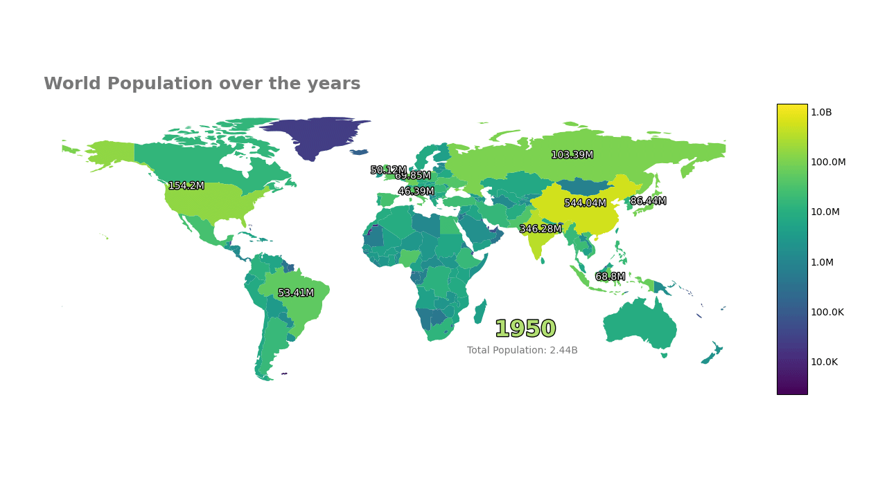

# Creating an Animated Choropleth
## The data

For the map data we will be using [Natural Earth — Admin 0 – Countries](https://www.naturalearthdata.com/downloads/110m-cultural-vectors/110m-admin-0-countries/).
Click the download countries and grab the ne_110m_admin_0_countries.
For the population data we will be using [ourworldindata population data](https://ourworldindata.org/grapher/population-unwpp?overlay=download-data), grab the full data with around 19k rows.

*Some of the displayed tables are shortened for easier understanding, you will get a larger table trying to replicate this.*
## Converting long data to wide data

```python
df = pd.read_csv('data/population.csv')
df.head()
```

| # | Entity | Code | Year | Population |
|---:|---|---|---:|---:|
| 0 | Afghanistan | AFG | 1950 | 7,776,180 |
| 1 | Afghanistan | AFG | 1951 | 7,879,343 |
| 2 | Afghanistan | AFG | 1952 | 7,987,784 |
| 3 | Afghanistan | AFG | 1953 | 8,096,703 |
| 4 | Afghanistan | AFG | 1954 | 8,207,954 |

We will be joining both the population and map data on the Country ISO_A3 code column, so better to remove any nan code(ISO_A3) before hand.  
```python
df.isna().sum()

>>>
Entity         0
Code         592
Year           0
all years      0
dtype: int64

df = df.dropna()
```

Now for the important part, unlike the rest of the library, time variable here is kept as individual columns and not as a
single column/index. This design choice was chosen so it is easier to work with geopandas as geopandas requires all geometries in a column to work.  
In a nutshell previously we had.  

```text
        [other var]
           |
           |
[Time]--- [value]
```

For choropleth we have the following wide-data format.

```text
              [Time]
                |
                |
[Geometry]--- [value]
```
So we will pivot it like this:
```python
df = df.pivot(index=['Entity','Code'], columns='Year', values='all years').reset_index()
df.head()
df.to_csv("pivot_population.csv",index=False)
```

| # | Entity | Code | 1950 | 1951 | 1952 | 1953 | 1954 | 1955 | 1956 | 1957 |
|---:|---|---|---:|---:|---:|---:|---:|---:|---:|---:|
| 0 | Afghanistan | AFG | 7,776,180 | 7,879,343 | 7,987,784 | 8,096,703 | 8,207,954 | 8,326,981 | 8,454,303 | 8,588,340 |
| 1 | Africa | OWID_AFR | 227,776,838 | 232,557,370 | 237,539,910 | 242,685,417 | 248,006,203 | 253,538,234 | 259,271,764 | 265,129,059 |
| 2 | Africa (UN) | UN_AFR | 227,776,420 | 232,556,973 | 237,539,543 | 242,685,066 | 248,005,819 | 253,537,849 | 259,271,438 | 265,128,663 |
| 3 | Albania | ALB | 1,247,854 | 1,276,365 | 1,308,368 | 1,343,581 | 1,381,088 | 1,418,855 | 1,456,823 | 1,497,954 |
| 4 | Algeria | DZA | 9,018,423 | 9,269,870 | 9,521,212 | 9,772,644 | 10,014,393 | 10,247,429 | 10,482,183 | 10,717,503 |

Which gives us 254 regions over 74 years, as you can see not all regions here are countries.
```python
df.shape
(254, 76)
```
## Reading the shp file
We will be using geopandas for all the 'maplysis' stuff.
```python
mapdf = geo.read_file('ne_110m_admin_0_countries.shp')
mapdf.head()
```

| # | featurecla | scalerank | LABELRANK | SOVEREIGNT | SOV_A3 | ADM0_DIF | LEVEL | TYPE | TLC | ADMIN | geometry |
|---:|---|---:|---:|---|---|---:|---:|---|---:|---|---|
| 0 | Admin-0 country | 1 | 6 | Fiji | FJI | 0 | 2 | Sovereign country | 1 | Fiji | MULTIPOLYGON (((180 -16.067, 180 -16.555, 179.... |
| 1 | Admin-0 country | 1 | 3 | United Republic of Tanzania | TZA | 0 | 2 | Sovereign country | 1 | United Republic of Tanzania | POLYGON ((33.904 -0.95, 34.073 -1.0598, 37.699... |

We only care about the Geometry for plotting and ISO_A3 for joining.

```python
mapdf = mapdf[["ISO_A3","geometry"]]
mapdf.head()
```

| # | ISO_A3 | geometry |
|---:|---|---|
| 0 | FJI | MULTIPOLYGON (((180 -16.067, 180 -16.555, 179.... |
| 1 | TZA | POLYGON ((33.904 -0.95, 34.073 -1.0598, 37.699... |
| 2 | ESH | POLYGON ((-8.6656 27.656, -8.6651 27.589, -8.6... |
| 3 | CAN | MULTIPOLYGON (((-122.84 49, -122.97 49.003, -1... |
| 4 | USA | MULTIPOLYGON (((-122.84 49, -120 49, -117.03 4... |

There are additional region / country in both data, I will leave exploring that as an assignment.
```python
df.shape, mapdf.shape
>>>((254, 76), (177, 2))
len(set(mapdf.ISO_A3).intersection(set(df.Code)))
>>170
```
Merging both data to get our desired wide-data format.
We are doing an Inner join to get the common countries in both data.  
*note - unlike population data, mapdata here only contain countries.*

```python
mapdf.columns = ["Code", "geometry"]
mapdf = pd.merge(mapdf, df, how='inner', on=['Code'])
mapdf.to_csv("pop.csv",index=False)
mapdf.shape
```
(170, 77)

Our expected wide-data format: We have got our geometry column, time unit as columns and additional information variables like entity.
Now onto the animation plotting.  

| # | Code | geometry | Entity | 1950 | 1951 | 1952 | 1953 | 1954 | 1955 | 1956 |
|---:|---|---|---|---:|---:|---:|---:|---:|---:|---:|
| 0 | FJI | MULTIPOLYGON (((180 -16.067, 180 -16.555, 179.... | Fiji | 309,525 | 316,137 | 323,374 | 331,225 | 339,754 | 349,084 | 359,218 |
| 1 | TZA | POLYGON ((33.904 -0.95, 34.073 -1.0598, 37.699... | Tanzania | 7,625,152 | 7,812,973 | 8,009,083 | 8,213,117 | 8,424,792 | 8,644,856 | 8,874,780 |

## Using Pynimate Choropleth

First convert the geometry strings (we are reading them as strings initially) into objects.

```python
mapdf["geometry"] = mapdf["geometry"].apply(wkt.loads)
mapdf = geo.GeoDataFrame(mapdf, geometry=mapdf.geometry)
```

We will be using `pynimate.Choropleth` for setting up our Choropleth plot.  

The `from_widedf()` constructor is handy here for easily passing the wide-data without creating a
GeoDatafier.  

| Argument | Value | Description |
|---|---|---|
| `data` | `data` | Our created wide-format data |
| `time_format` | `"%Y"` | The data contains year-only time values, like '1991', '1992' etc |
| `ip_freq` | `"6MS"` | We interpolate every 6 months for a smoother animation |
| `log_norm` | `True` | The country-wise population data is highly skewed, so we use a logarithmic scale for better visualization |

The  `annot_geo` parameters are interesting.  
`annot_geo_masks` parameter is used to specifically include or exclude (prefix column name with `~`) rows. 
Here we are excluding population of geometry 'BGD' (Bangladesh) from being annotated throughout the animation, as it is overlapping with India.  

Parameter `annot_geo_filter` on the other hand is used to filter 'n' values of each time column, in this case we are keeping only top 10 most populous country for any time frame.


```python
canvas = nim.Canvas()
plot = nim.Choropleth.from_widedf(
    data,
    "%Y",
    "6MS",
    log_norm=True,
    annot_geo_masks={"~Code": ["BGD"]},
    annot_geo_filter=top_n(10),
)
```
Some more theming and customizations.

```python
plot.set_title(
    "World Population over the years",
    0.02,
    1.05,
    size=18,
    color="#777777",
    weight=600,
)
```

The code snippets below are good examples on how to utilize the callback features.  
For instance, here the api exposes time frame `i` and datafier `dfr`.

The below snippet utilizes this to show the world population of a time frame (6 months for our case)  
First we take the sum of a column / time frame, get the human_readable string of it, like 2.5m,etc and add some an string literal like 'Monthly Total: 2.5K'  


`"".join(("Monthly Total: ", human_readable(dfr.data[dfr.time_cols[i]].sum()))`


```python
plot.set_text(
    "time",
    callback=lambda i, dfr: dfr.time_cols[i].strftime("%Y"),
    x=0.8,
    y=0.3,
    size=23,
    color="#b3df72",
    weight=800,
    ha="center",
    path_effects=[pe.withStroke(linewidth=2, foreground="black")],
)

plot.set_text(
    "sum",
    callback=lambda i, dfr: "".join(
        ("Monthly Total: ", human_readable(dfr.data[dfr.time_cols[i]].sum()))
    ),
    x=0.68,
    y=0.24,
    size=10,
    color="#777777",
    weight=200,
)
```

Finally we save the animation.  
```python
canvas.add_plot(plot)
ani = canvas.animate(interval=200)
canvas.save("ma2", fps=24, extension="mp4")
plt.show()
```
As you can see, majority of the work is performing the data transformation.   
Pynimate makes rest of the animation process very simple.  
## Result!
