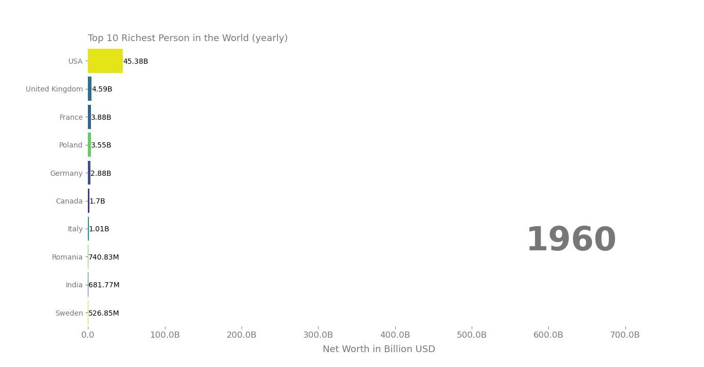

# Pynimate
Python package for statistical data animations.

## How to use
pynimate expects pandas dataframe formatted in this manner:  
Where the time column is set to index.
```python
time, col1, col2, col3
2012   1     2     1
2013   1     1     2
2014   2     1.5   3
2015   2.5   2     3.5
```
## Bar Chart Example
```python
from matplotlib import pyplot as plt
import pandas as pd
import pynimate as nim

df = pd.DataFrame(
    {
        "time": ["1960-01-01", "1961-01-01", "1962-01-01"],
        "Afghanistan": [1, 2, 3],
        "Angola": [2, 3, 4],
        "Albania": [1, 2, 5],
        "USA": [5, 3, 4],
        "Argentina": [1, 4, 5],
    }
).set_index("time")
bar = nim.BarBasic(df, "%Y-%m-%d", "2d")
bar.set_time(callback=lambda i, data, time, rank: time[i].strftime("%b, %Y"))
bar.animate()
plt.show()
```

